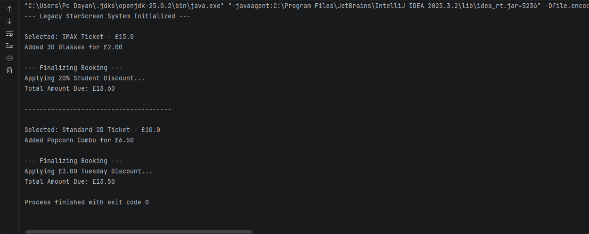
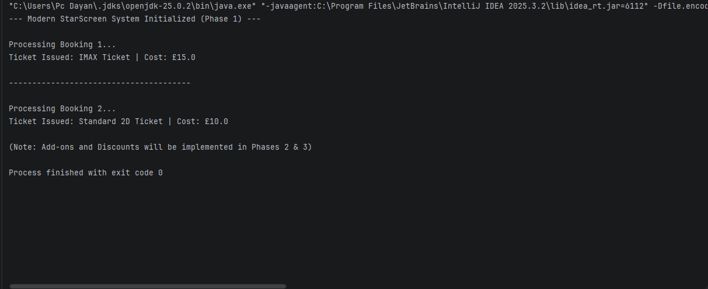
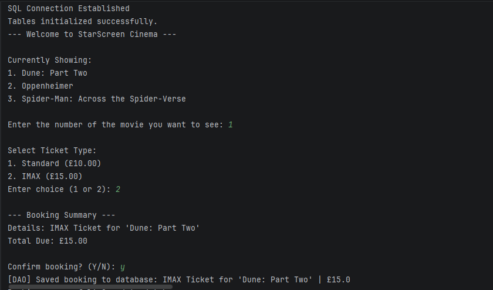
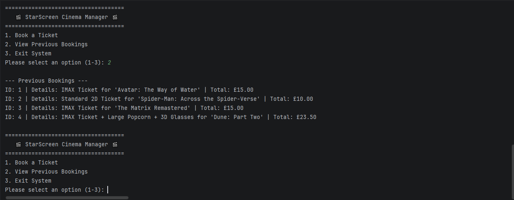
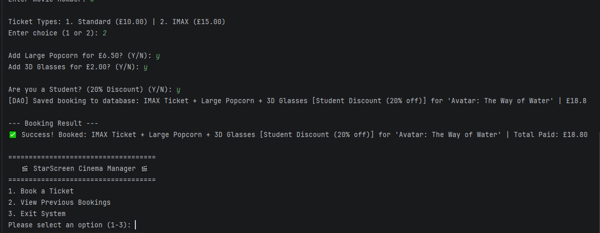
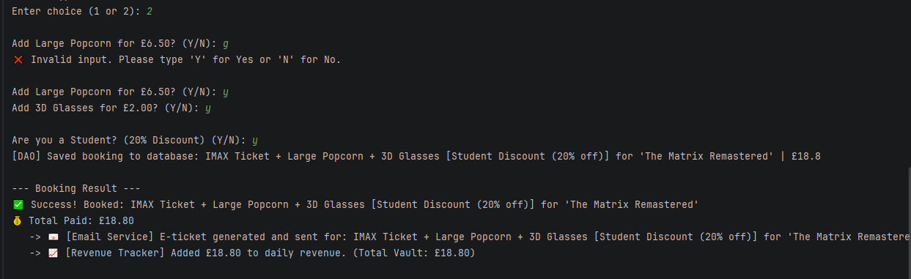

# StarScreen Ticket Manager 🍿 v2.3

**Assessment 2: Advanced Software Development (SWE7302)**

## 📋 Project Overview
StarScreen Ticket Manager is an educational project that shows how to refactor poorly designed legacy code into a modern, maintainable architecture using design patterns.

The original(legacy) system was built as a single ,coupled design. It manages the logic of the project all within a single  class using  `if-else` chains. This project serves as a "before and after" showcase, the transformation into a modular, scalable architecture.

### 🛑 The "Before" State: Legacy Code

## 🏗 Progress & Patterns

###  Phase 1: Ticket Instantiation & Factory Pattern (Completed)
* **Background:** The legacy `selectTicket` method used hardcoded `if/else` logic to create standard or IMAX tickets.
* **Goal:** Introduce a **Creational Pattern (Factory Method)** to cleanly create `ImaxTicket` or `StandardTicket` objects in a clean manner that eliminates strict dependencies and the Open/Closed Principle.

###  Phase 2: Database Implementation (Singleton & DAO Patterns) (Completed)
* **Background:** The system required a stable method to store the bookings completed and retrieve the movies available without causing any mess on the main application code with SQL queries or exposing the system to numerous connections with the database.
* **Goal:** An implementation of the Singleton Pattern through DatabaseHandler to make sure that there should be only one active SQLite connection. Enacted the Data Access Object (DAO) Pattern through BookingDAO in order to decouple database transactions and business logic, which met the Single Responsibility Principle.

###  Phase 3: Dynamic Add-ons (Decorator Pattern) & Interactive Menu (Completed)

* **Background:** `addExtra` method legacy was based on comparison of the strings that was not that strong and it added 3D glasses or popcorn. There was the danger of creating a class explosion or colossal conditional blocks when the new snacks were added. Moreover, the UI did not provide an opportunity to see past data.
* **Goal:** Structural Pattern (Decorator) was put in place. Developed a layer `TicketDecorator` and dynamically encased it with `PopcornDecorator` and `GlassesDecorator` to compute prices without any modification of the main  `ITicket`  implementations. Also, modified the main application loop to add an interactive menu which reconstructs and lists the past database bookings.

### Phase 4: Pricing Rules & Strategy Pattern (Completed)
Since the core ticket creation, dynamic snacks, and database persistence have been made to work, the next step involves the flexible pricing.
* **Background:** Hard coded mathematics to `checkout` Student discounts in the legacy checkout method are a violation of the Single Responsibility Principle and Open/Closed Principle.
* **Goal:** Adopted a Behavior Pattern (Strategy). Moved the math of the discounts into a `PricingStrategy` interface which can be configured to use different classes (`StudentStrategy`, `RegularPricingStrategy`) to permit the addition of new promotion rules without necessarily changing the fundamental checkout logic.

### ✅ Phase 5: System Decoupling & Facade Pattern (Completed)
* **Background:** The console UI (`ModernMain) was becoming extremely bound to various design pattern implementations (Factory, Decorator, Strategy) and the Database DAO and it was hard to eventually migrate to a modern Web UI.
* **Goal:** Took effect a Structural Pattern (Facade) through `CinemaApiFacade`. This gives one simple API entry point with which to book tickets, obscuring the underlying complex subsystem logic. This neatly segregates the business-logic of the back end and the front end, in the best possible way to present the application to an HTML/CSS/JS web integration.

### ✅ Phase 6: Post-Booking Events & Observer Pattern (Completed)
* **Background:** Once a successful booking was made the system had to activate other processes (such as confirmation email and day to day revenue tracking). Coding these steps into the main booking process would be a violation of the Single Responsibility Principle as well as produce rigid and coupled code.
* **Goal:** Adopted a Behavioral Pattern (Observer). Developed a `BookingEventManager` (Publisher) and separate listener classes (`EmailNotificationService`, `RevenueTracker`). Once a ticket is booked, the Facade will inform the event manager, and all observers who were subscribed will be notified automatically and their logs are gathered to the UI. This creates an event-driven architecture, which enables post-booking feature additions without changing the core system.

## 👤 Author
**Amir Tavassoli**
MSc Software Engineering | University of Bolton

## 📄 License
This is an educational project created for portfolio and assessment purposes.