# StarScreen Ticket Manager v3

**Assessment 2: Advanced Software Development (SWE7302)**

## Project Overview
StarScreen Ticket Manager is an educational project that shows how to refactor poorly designed legacy code into a modern, maintainable architecture using design patterns.

The original(legacy) system was built as a single,coupled design. It manages the logic of the project all within a single  class using  `if-else` chains. This project serves as a "before and after" showcase, the transformation into a modular, scalable architecture.

### The "Before" State: Legacy Code

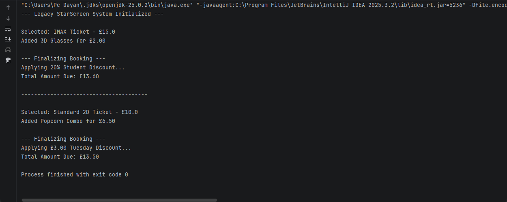

## Progress & Patterns

### Phase 1:Changing hardcoded legacy version into modern Instantiation using Factory Pattern (Completed)
* **Context:** The legacy `selectTicket` method used hardcoded `if/else` logic to create tickets.
* **Implementation:** I introduced a **Creational Pattern (Factory Method)** to create `ImaxTicket` or `StandardTicket` objects in a clean manner that eliminates dependencies and the Open/Closed Principle.

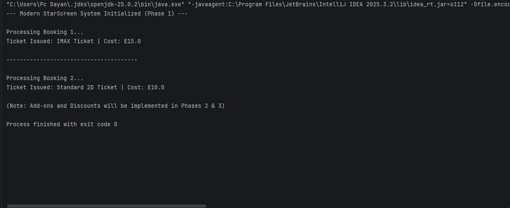

### Phase 2:Adding Database to the project (using Singleton & DAO Patterns) (Completed)
* **by implementing the Singleton Pattern through DatabaseHandler I made sure that there should be only ONE active SQLite connection.I used the Data Access Object (DAO) Pattern by creating `BookingDAO` so that all database operations are handled separately from the business logic. This keeps each class focused on one responsibility and follows the Single Responsibility Principle.

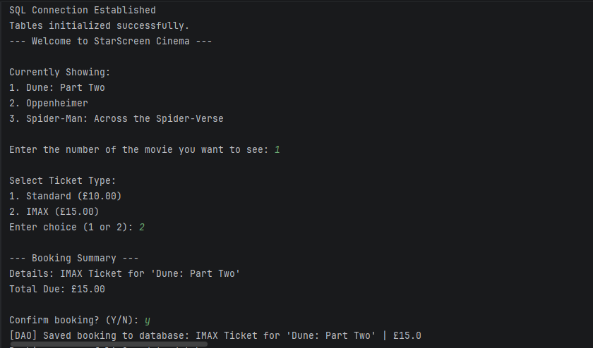

### Phase 3:Adding dynamic Add-ons (Decorator Pattern) and making menu interactive (Completed)

* **Background:** `addExtra` method in the legacy version was using string-based conditionals to add extras ,which was fragile.
* **Purpose:** Structural Pattern (Decorator) was put in place. To improve flexibility, the Decorator Pattern was implemented using `TicketDecorator` and dynamically wrapped tickets with `PopcornDecorator` and `GlassesDecorator`.

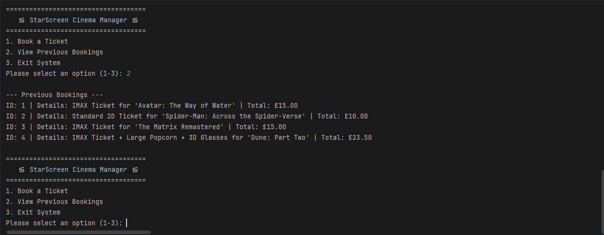

### Phase 4: Pricing Rules & Strategy Pattern (Completed)
In the legacy version, student discounts were calculated directly inside the checkout method using hard-coded logic.
This caused two main issues:
* **Issue1:** It violated the `Single Responsibility Principle` because the `checkout` method was handling both the booking process and pricing logic.
* **Issue2:** It violated the `Open/Closed Principle` because every time we wanted to introduce a new promotion or discount rule, we had to modify the existing checkout code.
* **Refactored Solution:** by Adopting a Behavior Pattern (Strategy) I Moved the math of the discounts into a `PricingStrategy` interface created separate implementations such as (`StudentStrategy`, `RegularPricingStrategy`).Now,the checkout process simply uses a pricing strategy without knowing the details of how the price is calculated.

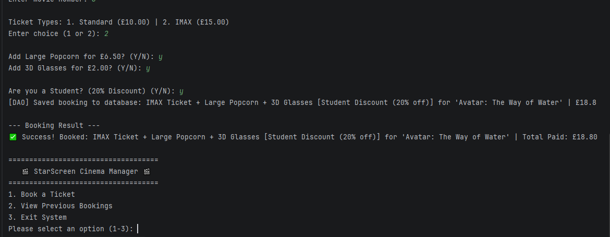

### Phase 5: System Decoupling & Facade Pattern (Completed)
As more design patterns were introduced (Factory, Decorator, Strategy, DAO), the ModernMain console class became coupled.
This created one huge issue:
* **Issue:** The console UI (`ModernMain) was involved with pattern implementations (Factory, Decorator, Strategy) and the Database DAO and it would make it difficult to migrate to a modern Web UI.
* **Solution:** To address this, I implemented the `Facade Pattern` by introducing `CinemaApiFacade`. This class acts as a single, simple entry point for the system.now the UI only needs to call the Facade and the system will handle the rest.

### Phase 6: Post-Booking Events & Observer Pattern (Completed)
After the booking was completed,I wanted to add additional actions such as:Sending confirmation emails.
* **Possible problem:** If these actions were coded directly inside the booking process, it would Violate the `Single Responsibility Principle` and also it would create a tight coupling.
* **Goal:** To solve this I adopted a Behavioral Pattern (Observer) and created a `BookingEventManager` (Publisher) and separate listener classes such as `EmailNotificationService`.

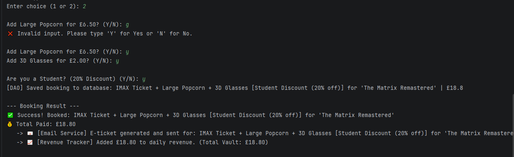

### Phase 7:Adding testing using jupiter for both database connection and dashboard(Completed)
* **Background:** The legacy system was not tested and it was not possible to add new features without breaking the existing tests.
* **Goal:** Added unit tests for the database connection and the dashboard.
* **Testing1:** as shown below at first the test for the database connection is successful but pricing is not working as expected.

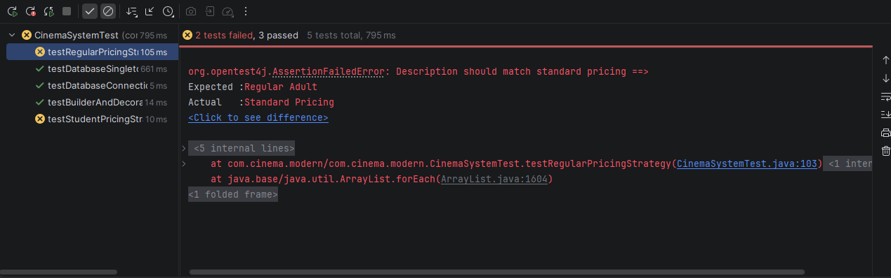

* **Testing2:** after fixing the pricing issue the test for the dashboard is successful.only couple of warnings remain which are caused by java versions.

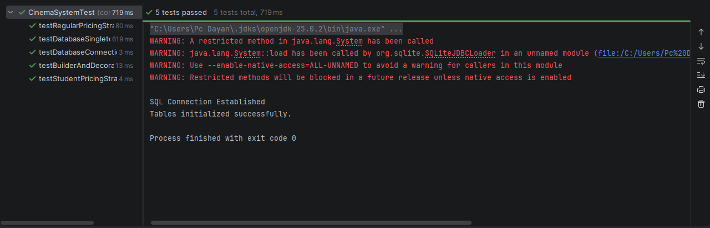

### Phase 8: Graphical User Interface(GUI) & FINAL TESTING (Completed)
To move beyond a basic console application, a modern JavaFX GUI was developed (`CinemaDashboard`).The UI was created using the `Wizard Design Pattern`,breaking bookings into steps and allowing users to navigate through the process.
* **Step 1: Movie Selection(loading of available movies using the Facade).**

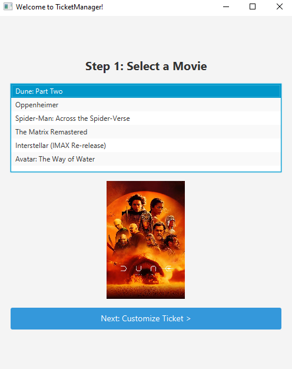

* **Step 2: Customizing the ticket(triggering the `TicketBuilder` to create the ticket obj and the decorator pattern for add-ons).**

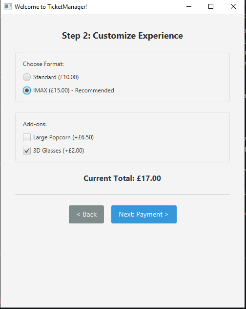

* **Step 3: Payment & Discount (This step activates the Behavioral `PricingStrategy`).**

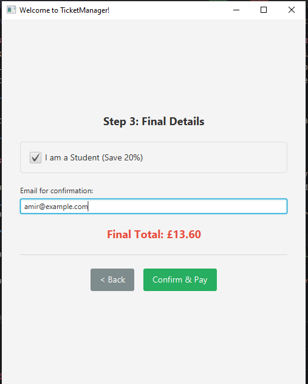

* **Step 4: Confirmation (showing the final receipt and system logs).**

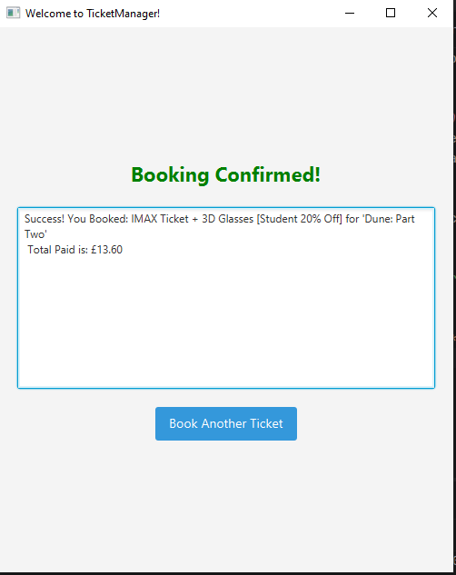

## 👤 Author
**Amir Tavassoli**
MSc Software Engineering | University of Greater Manchester

## 📄 License
This is an educational project created for portfolio and assessment purposes.